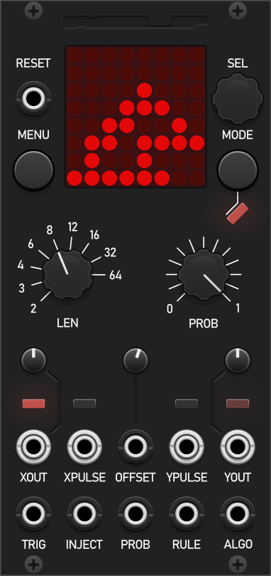

# Modular Mooch VCV

> [!IMPORTANT]
> It is recommended that the plugin is installed via the [VCV Rack Library](https://library.vcvrack.com/ModularMooch) to receive automatic updates.
> Instructions are provided below if you prefer to [install](#installing) manually or [build](#building) from source.

Plugin for [VCV Rack](https://vcvrack.com/) by Wesley Leggo-Morrell.

## Wolfram

A multi-algorithmic sequencer capable of generating complex patterns emerging from simple sets of rules. At any moment, a sequence can be captured and locked
into a loop of a given length, a concept developed by the iconic Turing Machine from Music Thing Modular. [Read the manual](img/manuals/Wolfram_Manual.pdf).

<p align="left">
  
</p>

## Installing

Download the latest release and place the `.vcvplugin` file in your Rack plugins folder. The plugin has only been tested on Windows so if you intend to use Linux or macOS be aware that it may not function as intented. If you encounter a problem please get in contact so I can debug and fix. Enjoy!

## Building

Set up the MINGW64 build environment by following the Rack [tutorial](https://vcvrack.com/manual/Building) and downloading the Rack SDK.

Clone or download the Modular-Mooch-VCV plugin source code.

```bash
git clone https://github.com/WesDaMooch/Modular-Mooch-VCV.git
cd Modular-Mooch-VCV
```

In the MINGW64 terminal, set the location of the Rack SDK folder and build:

```bash
export RACK_DIR=<Rack SDK folder>

cd Modular-Mooch-VCV

make          # Build but does not install
make clean    # Clean build artifacts
make install  # Build and install in the Rack plugin folder
make dist     # Create distribution package (manually place it in the Rack plugin folder)
```
